# ProofBid

**Evidence-driven autonomous tender preparation for The Taskmaster.**

ProofBid turns one synthetic tender event into a complete, reviewable preparation package. A Google ADK agent chooses bounded tools; deterministic domain code owns facts, pricing, BOM construction, validation, rendering, and the final release decision. Missing evidence stays missing. Signing, sending, pricing freeze, and submission remain locked.

## What the demo proves

```text
React event
  -> FastAPI returns 202
  -> Cloud Storage task state
  -> Cloud Run Job
  -> Gemini 3.5 Flash + Google ADK FunctionTools
  -> deterministic analysis / render / validation
  -> Trace + Word + Excel + JSON + ZIP
  -> React polls and downloads the validated bundle
```

The public workbench exposes only two built-in synthetic fixtures:

- `complete_tender`: all required evidence exists; both readiness flags are `true`.
- `blocked_missing_authorization`: its tender and catalog are byte-identical to the green fixture and its bidder profile removes only the project-specific manufacturer authorization. The result has exactly one missing item, `PROJECT_AUTHORIZATION_MISSING`; both readiness flags are `false`, and a complete validated ZIP is still delivered.

The legacy `synthetic_tender` fixture remains a separate six-gap pressure/regression case. It is not the public single-variable comparison.



The versioned English Mermaid source, SVG, and fixed 1920×1080 PNG are in [`docs/architecture/`](docs/architecture/). Re-render them with `bash infra/render-architecture.sh`, which pins Mermaid CLI 11.16.0.

A third test-only route injects one transient renderer failure and proves that the agent can choose exactly one legal `retry_render` recovery.

## Safety contract

- The model receives no path, SQL, shell, URL, price, evidence, or business-fact parameters.
- FunctionTools are bound to an immutable server-side `TaskRuntime`.
- The state machine enforces dependencies, call budgets, input digest, retry bounds, idempotency, and terminal conditions.
- `finalize_complete` is impossible until domain and delivery validators pass.
- A business evidence gap must end at `finalize_blocked`.
- Unknown tools, input drift, duplicate terminal actions, provider errors, and schema errors fail closed.
- `submission_executed=false` and `high_risk_actions_locked=true` are invariant.
- Public data is synthetic; arbitrary upload is disabled.

## Local quick start

Requirements: Python 3.12+, Node.js 22+.

```bash
python -m venv .venv
source .venv/bin/activate
python -m pip install '.[dev,google,service]'

cd apps/web
npm ci
npm run build
cd ../..

uvicorn proofbid.service:app --host 127.0.0.1 --port 8080
```

Open `http://127.0.0.1:8080`.

Run the three bounded local routes without a model call:

```bash
proofbid agent-run \
  --workspace examples/complete_tender \
  --output build/green

proofbid agent-run \
  --workspace examples/blocked_missing_authorization \
  --output build/blocked

proofbid agent-run \
  --workspace examples/complete_tender \
  --output build/recovery \
  --inject-render-failure
```

`proofbid run` remains the original deterministic regression baseline. `proofbid google-run` remains the v1 structured-planner path for backward compatibility. New agentic evidence must use `google-agent-run` or the Cloud Run Job; it cannot silently downgrade to deterministic execution.

## Real Gemini + ADK FunctionTool run

Use Vertex AI Application Default Credentials. Never place a key in the repository, command history, output bundle, or trace.

```bash
export PROOFBID_GEMINI_MODEL=gemini-3.5-flash
export PROOFBID_GEMINI_AUTH=vertex_ai
export GOOGLE_GENAI_USE_VERTEXAI=true
export GOOGLE_CLOUD_PROJECT=YOUR_ISOLATED_PROJECT
export GOOGLE_CLOUD_LOCATION=global

proofbid google-agent-run \
  --workspace examples/complete_tender \
  --output build/google-green
```

A valid real receipt must identify `google.gemini`, Vertex AI ADC, the configured `gemini-3.5-flash` model and observed model version, `STOP`, non-zero usage, invocation ID, event count, SDK versions, request/response digests, and one ADK `function_call_id` for every FunctionTool receipt. Before freezing the ZIP, the runtime replaces provisional local planning metadata and recursively scans packaged JSON, Office files, manifest, and archive for scripted fallback markers. This repository does not claim a real Gemini call until such a receipt is captured.

## HTTP API

### `POST /api/v1/tasks`

```json
{"fixture_id":"complete_tender"}
```

Returns `202 {"task_id":"...","status_url":"..."}`.

### `GET /api/v1/tasks/{task_id}`

Returns `accepted | queued | running | completed | blocked | failed`, current step, bounded tool receipts, readiness, Cloud execution ID, provider proof, evidence/validation summary, artifacts, and download readiness.

### `GET /api/v1/tasks/{task_id}/bundle`

Returns the ZIP only when the task is `completed` or `blocked` and delivery integrity passed.

### `GET /healthz`

Returns service health and build version only. It never invokes Gemini.

## Verification

```bash
python -m pytest

cd apps/web
npm run build
npm run test:e2e
```

The latest post-change local run passed 65 Python tests and 6 Playwright desktop/mobile checks. Treat these counts as a dated snapshot, not a permanently fixed target.

The Playwright suite covers desktop and mobile layouts, both public fixture entry points, the complete event-to-download route, and horizontal overflow. Python tests cover deterministic regression, green/blocked/recovery agent routes, fail-closed contracts, API 202/poll/download gates, manifests, ZIPs, Word, and Excel consistency.

## Cloud Run deployment

The same image serves the React/FastAPI service and runs the background agent command. In an authorized Google Cloud Shell session:

```bash
export GOOGLE_CLOUD_PROJECT=YOUR_ISOLATED_PROJECT
export PROOFBID_TASK_BUCKET=YOUR_GLOBALLY_UNIQUE_BUCKET
bash infra/cloud-shell-deploy.sh
```

The script tags the image and both Cloud Run resources with the full source commit through `PROOFBID_BUILD_VERSION`. Its first revision permits only `complete_tender`, enables only the required APIs, creates separate service and job identities, applies a seven-day `tasks/` lifecycle, deploys a scale-to-zero service with maximum one instance, and deploys a single-task/single-parallelism Job with a ten-minute timeout. Review IAM bindings and billing before execution. Creating resources, deploying, making the service public, pushing a repository, publishing a video, and submitting to Devpost all require explicit owner authorization.

Only after the first green closure is reconciled, enable the one-authorization blocker:

```bash
bash infra/enable-blocked-fixture.sh
```

The renderer recovery route is administrator-only and never appears in the public API/UI:

```bash
bash infra/run-admin-recovery.sh
```

Collect a redacted, hash-reconciled evidence summary with one command; raw GCS objects and logs remain under the ignored `.proofbid/evidence-raw/` directory:

```bash
proofbid-cloud-evidence \
  --project "$GOOGLE_CLOUD_PROJECT" \
  --region us-central1 \
  --service proofbid \
  --job proofbid-agent \
  --bucket "$PROOFBID_TASK_BUCKET" \
  --task-id task-0123456789abcdef0123 \
  --execution projects/PROJECT/locations/REGION/jobs/proofbid-agent/executions/EXECUTION \
  --output docs/evidence/cloud/task-0123456789abcdef0123.json
```

The collector fails closed unless the task is terminal, artifact integrity passed, the provider receipt matches its manifest hash, every FunctionTool receipt has a call ID, and the task build version matches the serving revision environment.

Before public release, verify from a fresh clone with Python 3.12, Node 22, Chromium, Docker, and a real local Workbench path:

```bash
bash infra/verify-clean-clone.sh https://github.com/yyswordsman-CN/proofbid.git
```

## Delivery artifacts

Every v2 agentic bundle contains:

- `requirements.json`, `evidence.json`, `result.json`;
- `proofbid_report.docx`, `proofbid.xlsx`, `proofbid_bundle.zip`;
- `trace.jsonl`, `manifest.json`;
- `task_spec.json`, `execution_plan.json`, `planner_receipt.json`;
- `agent_run.json`, `tool_receipts.jsonl`.

The manifest and ZIP are exact-set validated and SHA-256 bound. The tool receipts bind each call to prior results and preserve one bounded retry relationship without storing prompts, source documents, secrets, or hidden reasoning.

## Scope and current evidence level

Implemented and locally verified: synthetic green/blocked/recovery routes, bounded ADK FunctionTool registration, deterministic readiness, FastAPI task API, fixture deployment allowlist, structured lifecycle logs, administrator-only recovery launcher, redacted cloud evidence collector, local background worker, GCS/Cloud Run adapters, React workbench, container and deployment assets.

Not yet verified here: a real Gemini network call, Google Cloud resource creation, Cloud Run deployment, public `.run.app` URL, Cloud Logging evidence, public repository, demo video, Credits request, or Devpost submission. See [PROJECT_CONTEXT.md](PROJECT_CONTEXT.md) for the current handoff and [rules-snapshot.md](docs/competition/rules-snapshot.md) for external-action gates.

## License and IP

ProofBid is licensed under [Apache-2.0](LICENSE). All fixtures are synthetic. See [PREEXISTING_IP.md](PREEXISTING_IP.md) and [THIRD_PARTY_NOTICES.md](THIRD_PARTY_NOTICES.md) for competition-period work and dependency disclosures.
