# ProofBid Architecture

> 2026-08-24 implementation snapshot. Cloud components are deployed and three green, three blocked, and one administrator recovery Service/Job/GCS execution have been independently reconciled.

Canonical presentation assets: [Mermaid source](architecture/proofbid-google-cloud.mmd), [SVG](architecture/proofbid-google-cloud.svg), and [1920×1080 PNG](architecture/proofbid-google-cloud-1920x1080.png). They are generated with pinned Mermaid CLI 11.16.0 through `infra/render-architecture.sh`.

## System flow

```mermaid
flowchart LR
  UI[React synthetic case event] -->|POST /api/v1/tasks| API[Cloud Run Service\nFastAPI + static UI]
  API -->|state / artifacts| GCS[(Cloud Storage\ntasks/task-id)]
  API -->|Jobs v2 run override| JOB[Cloud Run Job]
  JOB --> ADK[Google ADK Agent\nGemini 3.5 Flash]
  ADK --> TOOLS[Bounded FunctionTools]
  TOOLS --> CORE[Deterministic domain core\nEvidence / BOM / readiness]
  CORE --> RENDER[Controlled renderers]
  RENDER --> VALIDATE[Domain + delivery validators]
  VALIDATE --> GCS
  UI -->|poll every 2 seconds| API
  API -->|validated ZIP only| UI
```



The public service accepts only `complete_tender` and `blocked_missing_authorization`, returns `202`, writes task state, and starts one background Job. The Job uses the same image with `python -m proofbid.task_worker`. Local mode uses the same API and state contract with a single background worker and local object store.

## Trust and authority boundaries

| Boundary | May decide | Cannot decide |
|---|---|---|
| React event | Select one built-in synthetic fixture | Upload files, provide facts, submit a bid |
| Gemini + ADK | Choose registered tools, dependency-valid order, complete/blocked branch, one renderer retry | Paths, shell, SQL, URLs, prices, evidence, compliance, permissions |
| `TaskRuntime` | Enforce tool allowlist, call budget, dependency order, retry relation, terminal state | Invent facts or bypass validators |
| Deterministic domain core | Extract requirements, match evidence, construct BOM, identify missing items | Sign, send, freeze price, make commercial commitments |
| Validators | Release complete or blocked preparation package | Execute submission |
| Cloud identities | Service starts Job and accesses task objects; Job calls Vertex AI and accesses task objects | Broad project administration or human credentials |

All input document content is untrusted data. Tool functions accept no model-selected paths or business facts. Runtime objects are server-bound to a single task/input digest. `submission_executed=false` and `high_risk_actions_locked=true` are contract invariants.

## Agent v2 state machine

```text
declare_execution_plan
  -> scan_inputs
  -> extract_requirements ─┐
  -> load_bidder_evidence ─┼-> build_analysis -> validate_domain
  -> load_product_catalog ─┘                         |
                                                    v
                                             render_delivery
                                              |           |
                                           success    RENDER_TRANSIENT
                                              |           |
                                              |      retry_render once
                                              +-----------+
                                                    |
                                             validate_delivery
                                              |           |
                                         ready=true   ready=false
                                              |           |
                                      finalize_complete finalize_blocked
```

The declared plan preserves both deterministic terminal branches, but only the correct branch is executed. Core analysis dependencies may be ordered dynamically. `retry_render` is callable once and only after a recoverable render receipt. Unknown tools, missing dependencies, duplicate completed calls, more than 14 calls, input drift, invalid branch selection, provider/schema failure, and any other retry fail closed.

## Evidence and receipts

V2 delivery adds two artifacts to the existing planning and domain package:

- `agent_run.json`: task/input digest, parser/failure strategies, selected tools, observed provider/model/usage/invocation evidence, tool-receipt digest, terminal status, readiness, and locked high-risk actions.
- `tool_receipts.jsonl`: sequence, tool, status, reason code, duration, input digest, result digest, `retry_of` relation, and the ADK `function_call_id` for real FunctionTool calls. Scripted local calls retain `null` so they cannot be mistaken for provider evidence.

Real-provider mode is fail closed: the final receipt must bind `google.gemini`, Vertex AI ADC, configured `gemini-3.5-flash`, an observed model version, `STOP`, non-zero usage, invocation ID, and unique FunctionTool call IDs. The final freeze replaces provisional local planning metadata in `planner_receipt.json`, Trace, and `agent_run.json`, then recursively scans all package containers for scripted-policy markers.

No artifact contains a credential, complete prompt, hidden thought, or full source document. The final manifest exact-set binds all payload files and the ZIP. Planning evidence and Trace metadata are cross-validated. The Renderer runs only over structured domain objects.

## Readiness contract

`ReadinessDecision` is the sole external readiness shape:

```json
{
  "ready_for_human_review": true,
  "ready_for_submission": true,
  "submission_executed": false,
  "high_risk_actions_locked": true,
  "blocking_reason_codes": []
}
```

`complete_tender` must set both readiness flags to `true`; the missing-authorization fixture must set both to `false`, contain exactly one missing item, and expose `PROJECT_AUTHORIZATION_MISSING` rather than a task-specific random ID. A blocked task still returns a validated ZIP containing the evidence ledger and missing-item list. UI wording is “Preparation package ready for controlled submission”; it never says that submission occurred.

## Service and storage contracts

- `POST /api/v1/tasks` accepts one fixture ID and returns `202` plus a status URL.
- `GET /api/v1/tasks/{task_id}` returns accepted/queued/running/completed/blocked/failed plus minimal review summaries.
- `GET /api/v1/tasks/{task_id}/bundle` returns only completed/blocked deliveries whose artifact integrity passed.
- `GET /healthz` reports build health, commit-bound build version, and enabled fixtures only; it cannot trigger Gemini.
- GCS object prefix: `tasks/{task_id}/state.json` and `tasks/{task_id}/artifacts/{basename}`.
- Task IDs are restricted to `task-[0-9a-f]{20}` and artifact access collapses to fixed basenames.

The bucket lifecycle deletes `tasks/` objects after seven days. A curated evidence prefix, if added later, must have a separate retention rule rather than disabling the public task cleanup.

## Cloud resource profile

- Service: scale-to-zero, maximum one instance, public synthetic UI, dedicated service account.
- Job: one task, parallelism one, zero platform retries, ten-minute timeout, dedicated job account.
- Vertex AI: ADC, `gemini-3.5-flash`, location `global`; no API key stored.
- Storage: uniform bucket access, seven-day lifecycle.
- Logging: privacy-minimized JSON stdout events for `accepted`, `job_queued`, `running`, `provider_completed`, `delivery_ready`, and `delivery_failed`; application Trace remains packaged JSONL.

The initial deployment sets `PROOFBID_ALLOWED_FIXTURES=complete_tender` on both Service and Job. A separate administrator script opens `blocked_missing_authorization` only after green reconciliation. Renderer failure injection is a Job-only environment override and has no public API/UI control. `PROOFBID_BUILD_VERSION` carries the full commit SHA into the image-backed revision and every task state.

`proofbid-cloud-evidence` collects Service URL/revision/image, Job execution, task state, ProviderReceipt, usage and FunctionTool IDs, GCS generation/checksums, manifest/ZIP SHA-256 and redacted log timestamps. Raw downloads are kept in the ignored `.proofbid/evidence-raw/` directory; only the redacted JSON/Markdown summary is intended for version control.

The repository intentionally does not add Firestore, Pub/Sub, PDF/OCR, arbitrary upload, multi-agent orchestration, signing, or submission.

## Current evidence boundary

Verified: deterministic baseline, green/blocked/recovery local v2 routes, real ADK FunctionTool execution through Vertex AI ADC, state/receipt/digest gates, API event-to-download flow, React production build, desktop/mobile Chromium checks, a 50-case synthetic local Eval, and a three-green/three-blocked/one-recovery Cloud Run Service/Job/Gemini/GCS matrix with digest/log reconciliation.

Not yet verified: attributed Google Cloud cost, video, submission tag, or final Devpost submission. Public HTTPS clean-clone verification and Credits approval/redemption are recorded separately under `docs/evidence/`.
